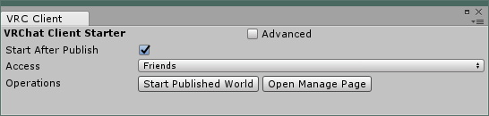
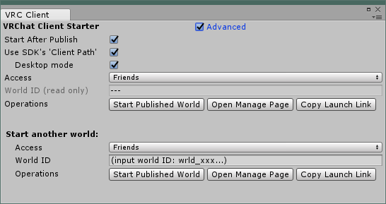

# Client Starter

This Unity editor extension starts VRChat client automatically after world publishing is completed.
You can go directly into published world and start to test it.

## Background: why I made this
In some means, this is similar to local test that is one of a VRChat SDK feature.
I can't completely trust with local test. I also do tests in ordinary client.
And selecting my world from quick menu operation is a pain. So I made this tool.

## How to use

* Install unitypackage. That's all.
    * When Publishing world process is completed, VRChat client starts automatically.
    * By default, it runs on desktop mode.
* If you want change setup, open setting window via Unity menu `Window > VRC_Iwsd > Client Starter`
* Setup window also serves other features. For example
    * Open world manage page at vrchat.com
    * Open another world specified by world ID

## features detail

### Simple UI mode features detail

* `Start After Publish` checkbox
    * If on, this tool starts VRChat client automatically after publish process completed.
    * This works even if setting window isn't opened. Once set up, you can close it.
    * This tool close "Content Successfully Uploaded! / Manage World in Browser" window showed by VRChat SDK.
        * internally, the appearance of this window is a trigger to start client.
        * If you need to use this window, turn off this `Start After Publish` option.
* `Access` selection
    * Select access level from invite, invite+ ...
* `Start Published World` button
    * If on, starts VRChat client manually
    * Non public `Access` selection requires being logged in. If not, open VRChat SDK Setting window.
* `Open Manage Page` button
    * Open world management page at vrchat.com
* `Advanced` checkbox
    * Show advanced settings and features.

### Advanced UI mode features detail

* `World ID (read only)` field
    * Automatically filled with editing scene's ID after some operation
    * You can copy this string to clip board
* `Copy Launch Link` button
    * Copy launch link (a URI formatted `vrchat://...`) string of the world to clip board.
* `Start another world` section
    * This section treats a world selected by what you manually type in ID field.
    * Used to refer to a different world than the one being edited for comparison or so on
* `World ID` field
    * Type world ID to select.
    * "world ID" is a string formatted like `wrld_b51f016d-1073-4c75-930d-9f44222c7fc3`
    * accepts extra characters. It will be just ignored.
        * For example, you can input shared link itself formatted like
        `https://vrchat.com/home/launch?worldId=wrld_b51f016d-1073-4c75-930d-9f44222c7fc3`
        You need not to delete heading part.
* `Use SDK's 'Client Path'` checkbox
    * On: Use a program specified `Installed Client Path` to start.
        * It is in VRChat SDK Setting window. You can change it `Edit` button in it.
        * If you installed Occurs client only (in other words, you don't have Steam version)
        and you don't setup specific path to `Installed Client Path` (in other words, leave it as default),
        it will fail to start.
            * This is because I don't have information that I need to write codes handling this case.
            * Workaround: set `Installed Client Path` where VRChat.exe is
    * Off: Open launch link (vrchat://...) to start
        * By default, Windows runs `{VRChat installed folder}/launch.bat` and it runs VRChat.exe
* `Desktop mode` checkbox
    * Start VRChat in desktop mode if on.
    * This option is available only when `Use SDK's 'Client Path'` is on.

## Acknowledgments
Thanks VRCPrefabs and iwashi farm people for testing and suggestions.

## License and misc.

* Under MIT License
* Hosted at https://github.com/naqtn/ProgrammingInVRChat
* If you have defect reports or feature requests, please tell me (https://twitter.com/naqtn) and/or
post to GitHub issue (https://github.com/naqtn/ProgrammingInVRChat/issues)

<!--
## internal issues note

* Save options to EditorPrefs
    * I chose that it does not save ID. Both user and world.
* Better polling ContentUploadedDialog
    * Taking CPU time only just few seconds after play mode ends
    * I chose update callback is always hooked
    * While the dialog opened, and `Start After Publish` is turned on, that doesn't nothing.
        * Better update hook solve (handle well) this situation.
* In avatar scene case, Problems not happen because it does not show ContentUploadedDialog

-->
